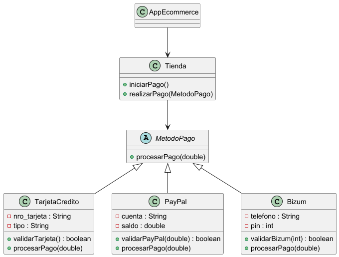

# Práctica 1. Sistema de pago e-commerce
## ÍNDICE
1. [Intro](https://github.com/ManuelPastorMartinez/2oTrimestre/new/main/2oTrimestre/src/main/java/e_commerce#1-Intro)
2. [Estructura de clases](#2-estructura-de-clases)
- Diagrama de clases UML
- Código de UML
- Contenido de clases (.java)
4. [Programa principal (InmoApp)](#3-programa-principal)
5. [pruebas](#4-pruebas)
6. [Entrega](#5-Entrega)

  ### 1. Intro
> La práctica consiste en hacer un sistema de pagos para un e-commerce.
> La aplicación permite pagar con:Tarjeta de crédito,PayPal o Bizum
> El objetivo de la práctica era practicar herencia, polimorfismo y clases abstractas.
### 2. Estructura de clases

#### Diagrama de clases UML


#### Código de PlantUML

````
@startuml

abstract class MetodoPago {
    +procesarPago(double)
}

class TarjetaCredito {
    -nro_tarjeta : String
    -tipo : String
    +validarTarjeta() : boolean
    +procesarPago(double)
}

class PayPal {
    -cuenta : String
    -saldo : double
    +validarPayPal(double) : boolean
    +procesarPago(double)
}

class Bizum {
    -telefono : String
    -pin : int
    +validarBizum(int) : boolean
    +procesarPago(double)
}

class Tienda {
    +iniciarPago()
    +realizarPago(MetodoPago)
}

class AppEcommerce

MetodoPago <|-- TarjetaCredito
MetodoPago <|-- PayPal
MetodoPago <|-- Bizum

Tienda --> MetodoPago
AppEcommerce --> Tienda

@enduml

````
#### Contenido de las clases (.java)
- Clase **java.java**
package Programas;

import java.util.ArrayList;

public class Cadena {

    private String nombre;
    private ArrayList<Programa>listaProgramas;

    public Cadena(String nombre){
        this.nombre=nombre;
        listaProgramas=new ArrayList<>();
    }
    public String getNombre() {
        return nombre;
    }

    public void setNombre(String nombre) {
        this.nombre = nombre;
    }

    public ArrayList<Programa> getListaProgramas() {
        return listaProgramas;
    }

    public void setListaProgramas(ArrayList<Programa> listaProgramas) {
        this.listaProgramas = listaProgramas;
    }

    @Override
    public String toString() {
        return "Cadena{" +
                "nombre='" + nombre + '\'' +
                ", listaProgramas=" + listaProgramas +
                '}';
    }
}

package Programas;

public class Empleado {
    private static final String DEF_CARGO ="pte";
    private static final String CADENA_ID="EP0";
    private static int contadorCantidadEmpleados=0;

    private String id;
    private String nombre;
    private static int cantidadEmpleados=0;
    private String cargo;
    private Empleado director;

    public Empleado(String nombre,String cargo,Empleado director){
        this.nombre=nombre;
        setCargo(cargo);
        id=generarId();
        setCantidadEmpleados();
        this.director=director;
    }

    public Empleado(){
       cargo=DEF_CARGO;
    }

    private String generarId(){
        return CADENA_ID+cantidadEmpleados;
    }

    public String getId() {
        return id;
    }

    public void setId(String id) {
        this.id = id;
    }

    public String getNombre() {
        return nombre;
    }

    private String validarCargo(String cargo){
        if (cargo.equals("director")||cargo.equals("técnico")||cargo.equals("presentador")||cargo.equals("colaborador")){
            return cargo;
        }else {
            return DEF_CARGO;
        }
    }

    public void setNombre(String nombre) {
        this.nombre = nombre;
    }

    public String getCargo() {
        return cargo;
    }

    public void setCargo(String cargo) {
        this.cargo = validarCargo(cargo);
    }

    public static int getCantidadEmpleados() {
        return cantidadEmpleados;
    }

    public void setCantidadEmpleados(){
        cantidadEmpleados = ++contadorCantidadEmpleados;
    }


    public Empleado getDirector() {
        return director;
    }

    public void setDirector(Empleado director) {
        this.director = director;
    }

    @Override
    public String toString() {
        return "Empleado{" +
                "id='" + id + '\'' +
                ", nombre='" + nombre + '\'' +
                ", cargo='" + cargo + '\'' +
                ", director=" + director +
                '}';
    }
}

package Programas;

import java.time.LocalDate;
import java.time.LocalDateTime;
import java.util.Scanner;

public class Invitado {
    static Scanner teclado =new Scanner(System.in);

    private String nombre;
    private String profesion;
    private LocalDate fecha_visita;
    private int temporada;

    public Invitado(String nombre,String profesion,int temporada){
        this.nombre=nombre;
        this.profesion=profesion;
        this.temporada=temporada;
        setFecha_visita();
    }

    public String getNombre() {
        return nombre;

    }

    public void setNombre(String nombre) {
        this.nombre = nombre;
    }

    public String getProfesion() {
        return profesion;
    }

    public void setProfesion(String profesion) {
        this.profesion = profesion;
    }

    public LocalDate getFecha_visita() {
        return fecha_visita;
    }

    public void setFecha_visita() {
        System.out.println("Introduce el año de visita");
        int anyo_visita=teclado.nextInt();
        System.out.println("Introduce el mes de la visita");
        int mes_visita=teclado.nextInt();
        System.out.println("Introduce el dia de la visita");
        int dia_visita=teclado.nextInt();
        fecha_visita=LocalDate.of(anyo_visita,mes_visita,dia_visita);
    }

    public int getTemporada() {
        return temporada;
    }

    public void setTemporada(int temporada) {
        this.temporada = temporada;
    }

    @Override
    public String toString() {
        return "Invitado{" +
                "nombre='" + nombre + '\'' +
                ", profesion='" + profesion + '\'' +
                ", fecha_visita=" + fecha_visita +
                ", temporada=" + temporada +
                '}';
    }
}
package Programas;

import java.util.ArrayList;

public class Programa {
    private String nombre;
    private Cadena cadena;
    private int temporadas;
    private ArrayList<Empleado>listaEmpleados;
    private ArrayList<Invitado>listaInvitados;
    private Empleado director;

    public Programa(String nombre,Cadena cadena,String director){
        this.nombre=nombre;
        this.cadena=cadena;
        this.director=new Empleado("Director1","director",null);
        listaEmpleados=new ArrayList<>();
        listaInvitados=new ArrayList<>();
    }

    public void anyadirEmpleado(String nombre,String cargo){
        listaEmpleados.add(new Empleado(nombre,cargo,director));
    }

    public void anyadirInvitado(String nombre,String profesion,int temporadas){
        listaInvitados.add(new Invitado(nombre,profesion,temporadas));
    }

    public void invitadosTemporada(int temporada){

        System.out.println("Hay "+listaInvitados.size()+" invitados:");
        for (Invitado invitado:listaInvitados){
            if (temporada==invitado.getTemporada()){
                System.out.println(invitado.getNombre()+" que trabaja de "+invitado.getProfesion());
            }
        }
    }

    public int vecesInvitado(String nombre){
        int aux = 0;
        for (Invitado invitado:listaInvitados){
            if (nombre.equals(invitado.getNombre())){
                aux++;
            }
        }
        System.out.println("El invitado "+nombre+" ha ido "+aux+" veces al programa");
        return aux;
    }

    public void rastrearInvitado(String nombre){

        for (Invitado invitado: listaInvitados){
            if (invitado.getNombre().equals(nombre)){
                System.out.println(vecesInvitado(nombre)+" ha venido el "+invitado.getFecha_visita()+" en la temporada "+invitado.getTemporada());
            }
        }
    }

    public boolean buscarInvitado(String nombre){

        for (Invitado invitado : listaInvitados){
            if (nombre.equals(invitado.getNombre())){
                return true;
            }
        }
        return false;
    }

    public void invitadoAntes(String nombre){

    }
    public String getNombre() {
        return nombre;
    }

    public void setNombre(String nombre) {
        this.nombre = nombre;
    }

    public Cadena getCadena() {
        return cadena;
    }

    public void setCadena(Cadena cadena) {
        this.cadena = cadena;
    }

    public int getTemporadas() {
        return temporadas;
    }

    public void setTemporadas(int temporadas) {
        this.temporadas = temporadas;
    }
    public Empleado getDirector() {
        return director;
    }

    public void setDirector(Empleado director) {
        this.director = director;
    }

    public ArrayList<Empleado> getListaEmpleados() {
        return listaEmpleados;
    }

    public void setListaEmpleados(ArrayList<Empleado> listaEmpleados) {
        this.listaEmpleados = listaEmpleados;
    }

    public ArrayList<Invitado> getListaInvitados() {
        return listaInvitados;
    }

    public void setListaInvitados(ArrayList<Invitado> listaInvitados) {
        this.listaInvitados = listaInvitados;
    }

    @Override
    public String toString() {
        return "Programa{" +
                "nombre='" + nombre + '\'' +
                ", cadena=" + cadena +
                ", temporadas=" + temporadas +
                ", listaEmpleados=" + listaEmpleados +
                ", listaInvitados=" + listaInvitados +
                ", director=" + director +
                '}';
    }
}

}
[Link a la clase Programa en *GitHub*](https://github.com/ManuelPastorMartinez/2oTrimestre/tree/main/2oTrimestre/src/main/java/Programas)

### 3. Programa principal (ProgramasApp)
````package Programas;

public class ProgramasApp {
    public static void main (String[] args){
        //creamos una cadena de tv
        Cadena antena3 = new Cadena("Antena 3");
        System.out.println(antena3);
        //creamos un programa
        Programa el_hormiguero = new Programa("El Hormiguero",antena3,"Director1");
        System.out.println(el_hormiguero);
        System.out.println(antena3);
        //insertamos empleados en el programa
        el_hormiguero.anyadirEmpleado("Pablo Motos","presentador");
        System.out.println(el_hormiguero);
        //ver empleados del programa
        System.out.println(el_hormiguero.getListaEmpleados());
        //insertamos invitados en el programa
        el_hormiguero.anyadirInvitado("Aitana","cantante",1);
        //ver invitados del programa
        System.out.println(el_hormiguero.getListaInvitados());

    }
}
````
### 4. Pruebas
````package Programas;

public class ProgramasApp {
    public static void main (String[] args){
        //creamos una cadena de tv
        Cadena antena3 = new Cadena("Antena 3");
        System.out.println(antena3);
        //creamos un programa
        Programa el_hormiguero = new Programa("El Hormiguero",antena3,"Director1");
        System.out.println(el_hormiguero);
        System.out.println(antena3);
        //insertamos empleados en el programa
        el_hormiguero.anyadirEmpleado("Pablo Motos","presentador");
        System.out.println(el_hormiguero);
        //ver empleados del programa
        System.out.println(el_hormiguero.getListaEmpleados());
        //insertamos invitados en el programa
        el_hormiguero.anyadirInvitado("Aitana","cantante",1);
        //ver invitados del programa
        System.out.println(el_hormiguero.getListaInvitados());

    }
}
````
### 5. Entrega

- [X] Código fuente en GitHub: [Link]()
- [ ] Documentación
- [ ] Pruebas
