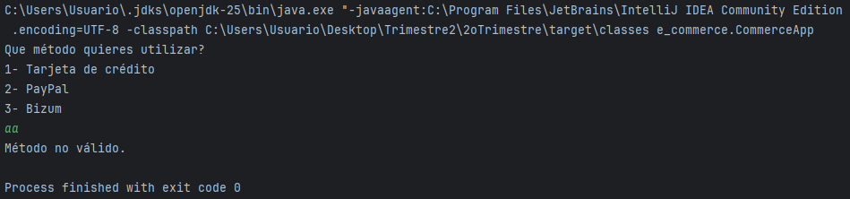
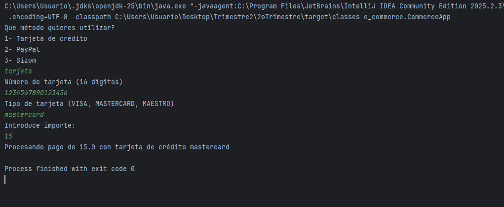
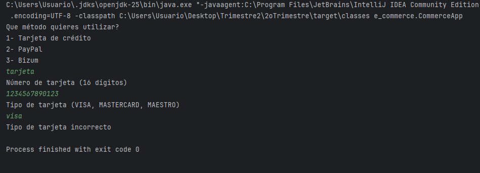
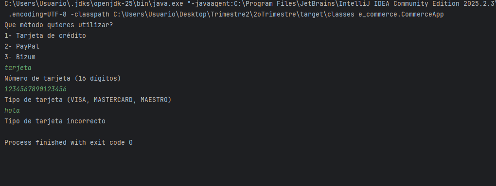
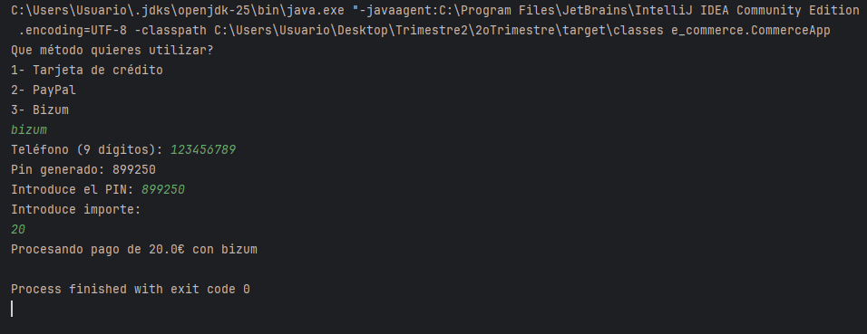
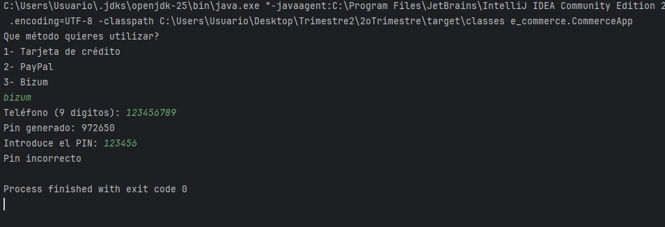
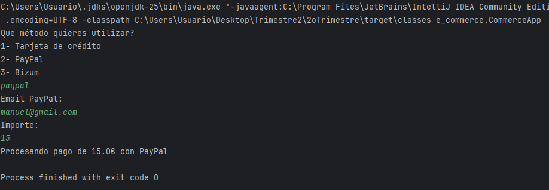
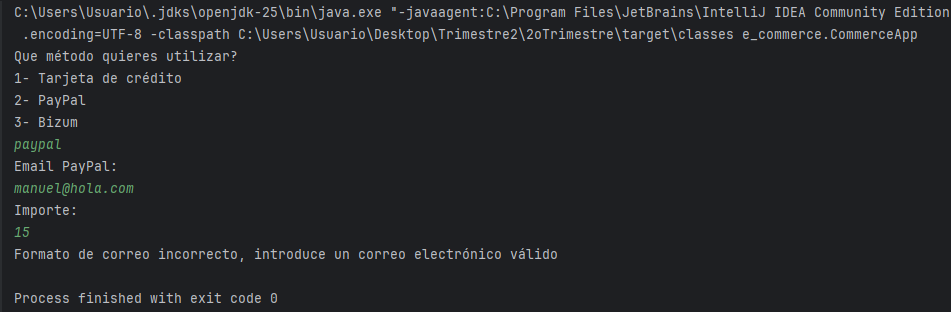
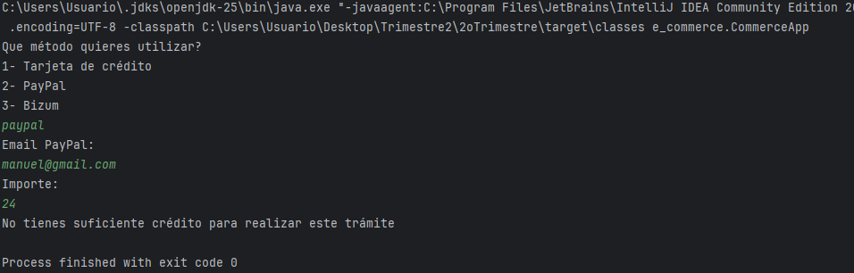

# Práctica 1. Sistema de pago e-commerce
## ÍNDICE
1. [Intro](https://github.com/ManuelPastorMartinez/2oTrimestre/new/main/2oTrimestre/src/main/java/e_commerce#1-Intro)
2. [Estructura de clases](#2-estructura-de-clases)
- Diagrama de clases UML
- Código de UML
- Contenido de clases (.java)
4. [Programa principal (CommerceApp)](#3-programa-principal)
5. [pruebas](#4-pruebas)
6. [Entrega](#5-Entrega)

  ### 1. Intro
> La práctica consiste en hacer un sistema de pagos para un e-commerce.
> La aplicación permite pagar con:Tarjeta de crédito,PayPal o Bizum
> El objetivo de la práctica era practicar herencia, polimorfismo y clases abstractas.
### 2. Estructura de clases

#### Diagrama de clases UML


#### Código de PlantUML

````
@startuml

abstract class MetodoPago {
    +procesarPago(double)
}

class TarjetaCredito {
    -nro_tarjeta : String
    -tipo : String
    +validarTarjeta() : boolean
    +procesarPago(double)
}

class PayPal {
    -cuenta : String
    -saldo : double
    +validarPayPal(double) : boolean
    +procesarPago(double)
}

class Bizum {
    -telefono : String
    -pin : int
    +validarBizum(int) : boolean
    +procesarPago(double)
}

class Tienda {
    +iniciarPago()
    +realizarPago(MetodoPago)
}

class AppEcommerce

MetodoPago <|-- TarjetaCredito
MetodoPago <|-- PayPal
MetodoPago <|-- Bizum

Tienda --> MetodoPago
AppEcommerce --> Tienda

@enduml

````
#### Contenido de las clases (.java)
- Clase **MetodoPago.java**
package e_commerce;

public abstract class MetodoPago {

    public abstract void procesarPago(double importe);
}

- Clase **Bizum.java**
package e_commerce;

import java.util.Random;

public class Bizum extends MetodoPago{

    private static final String  FORMATO_TELEFONO= "\\d{9}";

    private String telefono;
    private int pin;

    public Bizum(String telefono){
        this.telefono=telefono;
        this.pin = generarPin();
        System.out.println("Pin generado: "+pin);
    }

    private int generarPin(){

        Random random = new Random();

        return random.nextInt(100000,999999);
    }


    public boolean validarBizum(int pinIntroducido){

        if (!telefono.matches(FORMATO_TELEFONO)){
            System.out.println("Formato de telefono incorrecto, por favor introduce un teléfono correcto");
            return false;
        }

        if (pinIntroducido !=pin){
            System.out.println("Pin incorrecto");
            return false;
        }
        return true;
    }

    @Override
    public void procesarPago(double importe) {
        System.out.println("Procesando pago de "+importe+"€ con bizum");
    }
}

- Clase **PayPal.java**
package e_commerce;

public class PayPal extends MetodoPago{

    private static final String FORMATO_CUENTA = "^[A-Za-z0-9+_.-]+@gmail.com";

    private String cuenta;
    private double saldo=23;

    public PayPal(String cuenta){
        this.cuenta = cuenta;
    }

    public boolean validarPayPal(double importe){
        if (!cuenta.matches(FORMATO_CUENTA)){
            System.out.println("Formato de correo incorrecto, introduce un correo electrónico válido");
            return false;
        }

        if (saldo<importe){
            System.out.println("No tienes suficiente crédito para realizar este trámite");
            return false;
        }

        return true;
    }

    public String getCuenta() {
        return cuenta;
    }

    public void setCuenta(String cuenta) {
        this.cuenta = cuenta;
    }

    public double getSaldo() {
        return saldo;
    }

    public void setSaldo(double saldo) {
        this.saldo=saldo;
    }

    @Override
    public void procesarPago(double importe) {
        System.out.println("Procesando pago de "+importe+"€ con PayPal");
    }
}

- Clase **TarjetaCredito.java**
package e_commerce;

import java.util.ArrayList;

public class TarjetaCredito extends MetodoPago{

    private static final String FORMATO_TARJETA="\\d{16}";

    private String nro_tarjeta;
    private String tipo;
    private static String tipoValido[] = {"VISA","MASTERCARD","MAESTRO"};

    public TarjetaCredito(String nro_tarjeta, String tipo) {
        this.nro_tarjeta = nro_tarjeta;
        this.tipo = tipo;
    }

    public boolean validarTarjeta(){
        boolean validar=false;
        if (!nro_tarjeta.matches(FORMATO_TARJETA)){
            validar=false;
        }else {
            for (String tipo : tipoValido){
                if (getTipo().toUpperCase().equals(tipo)){
                    validar=true;
                    break;
                }
            }
        }


        return validar;

    }

    public String getNro_tarjeta() {
        return nro_tarjeta;
    }

    public void setNro_tarjeta(String nro_tarjeta) {
        this.nro_tarjeta = nro_tarjeta;
    }

    public String getTipo() {
        return tipo;
    }

    public void setTipo(String tipo) {
        this.tipo = tipo;
    }

    @Override
    public void procesarPago(double importe) {
        System.out.println("Procesando pago de "+importe+" con tarjeta de crédito "+tipo);
    }
}

- Clase **Tienda.java**
package e_commerce;

import java.util.Scanner;

public class Tienda{
    static Scanner teclado = new Scanner(System.in);

    static void iniciarPago(){
        System.out.println("Que método quieres utilizar?");
        System.out.println("1- Tarjeta de crédito");
        System.out.println("2- PayPal");
        System.out.println("3- Bizum");
        String metodo = teclado.next();


        switch (metodo.toLowerCase()){
            case "tarjeta":
                System.out.println("Número de tarjeta (16 dígitos)");
                String numero = teclado.next();

                System.out.println("Tipo de tarjeta (VISA, MASTERCARD, MAESTRO)");
                String tipo = teclado.next();

                TarjetaCredito tarjeta = new TarjetaCredito(numero,tipo);

                if (tarjeta.validarTarjeta()){
                    realizarPago(tarjeta);
                }else {
                    System.out.println("Tipo de tarjeta incorrecto");
                }

                break;
            case "paypal":
                System.out.println("Email PayPal: ");
                String email = teclado.next();

                PayPal paypal = new PayPal(email);

                System.out.println("Importe: ");
                double importeIntroducido = teclado.nextDouble();

                if (paypal.validarPayPal(importeIntroducido)){
                    paypal.procesarPago(importeIntroducido);
                }
                break;

            case "bizum":
                System.out.print("Teléfono (9 dígitos): ");
                String telefono = teclado.next();
                Bizum bizum = new Bizum(telefono);

                System.out.print("Introduce el PIN: ");
                int pin = teclado.nextInt();

                if (bizum.validarBizum(pin)) {
                    realizarPago(bizum);
                }
                break;

            default:
                System.out.println("Método no válido.");

        }
    }


    static void realizarPago(MetodoPago metodo){

        System.out.println("Introduce importe: ");
        double importe = teclado.nextDouble();

        metodo.procesarPago(importe);
    }
}

[Link a las clases de ecommerce en *GitHub*](https://github.com/ManuelPastorMartinez/2oTrimestre/tree/main/2oTrimestre/src/main/java/e_commerce)

### 3. Programa principal (CommerceApp)
````
package e_commerce;

public class CommerceApp {

    public static void main(String[] args) {
        Tienda.iniciarPago();
    }
}

````
### 4. Pruebas
- Si pones un metodo inexistente:


- Si introduces una tarjeta válida con el pago correcto:


- Si pones una tarjeta de longitud incorrecta:


- Si pones un tipo de tarjeta no permitido:


- Si pones un bizum con pin correcto:


- Si pones un bizum con pin incorrecto:


- Si pones un PayPal con email correcto y saldo suficiente:


- Si pones un PayPal con email incorrecto:


- Si pones un PayPal con email correcto y saldo insuficiente:


### 5. Entrega

- [X] Código fuente en GitHub: [Link](https://github.com/ManuelPastorMartinez/2oTrimestre/tree/main/2oTrimestre/src/main/java/e_commerce)
- [ ] Documentación
- [X] Pruebas
